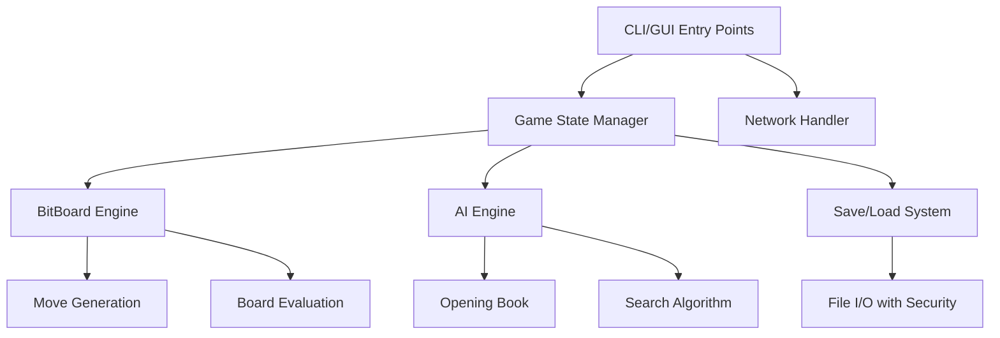

# Othello ゲームエンジン 設計ドキュメント

## 1. 概要 (Overview)

このシステムは、高性能なビットボードを基盤とした Othello/Reversi ゲームエンジンです。
AIアルゴリズムの研究・開発と、実用的なゲーム体験の両方を提供することを目的としています。
64-bit整数を用いたビットボード表現により、高速な盤面操作と効率的な探索を実現します。

**主要な機能:**
- ビットボードによる高速盤面表現と操作
- 複数難易度のAI対戦相手（easy/hard/expert）
- CLI/GUI両対応のユーザーインターフェース
- ネットワーク対戦機能
- 柔軟なボードサイズ対応（4x4〜26x26）
- ゲーム状態の保存・読み込み
- 包括的なテストスイートとセキュリティ対策

**技術スタック選定理由:**
- Python: プロトタイピングの容易さとAI研究コミュニティでの普及
- Tkinter: 外部依存なしでのGUI実装
- ビットボード: O(1)での盤面操作と高速な合法手生成

## 2. ユビキタス言語 (Ubiquitous Language)

Othelloゲームエンジンで使われる重要な用語を定義します。

| 日本語 | 英語名 | 説明 |
| :--- | :--- | :--- |
| 盤面 | Board/BitBoard | ゲームの状態を表現する8x8（または可変）のグリッド。黒石・白石・空きマスの配置を管理 |
| 石 | Piece/Stone | 盤面に配置される駒。黒（Black）と白（White）の2種類 |
| 合法手 | Legal Move | ルールに従って石を置ける位置。相手の石を挟める位置のみが有効 |
| 挟む | Flip/Capture | 自分の石で相手の石を両側から挟み、相手の石を自分の石に変える行為 |
| パス | Pass | 合法手がない場合に行う、石を置かずに手番を相手に渡す行為 |
| ゲーム状態 | Game State | 現在の盤面、手番、ゲーム履歴を含む全体的な状態 |
| AI思考 | AI Engine | コンピューターが最適な手を選択するためのアルゴリズム |
| 評価関数 | Evaluation Function | 盤面の優劣を数値で表現する関数 |
| 探索深度 | Search Depth | AIが先読みする手数の深さ |
| 定石 | Opening Book | 序盤の最適な手順を記録したデータベース |

## 3. データ構造 (Data Structures)

システムで扱う主要なデータ構造をPythonクラスとして記述します。

```python
# src/othello/board.py
class BitBoard:
    """ビットボードによる高速盤面表現"""
    black: int  # 黒石の配置（64-bit整数）
    white: int  # 白石の配置（64-bit整数）
    size: int   # ボードサイズ（4-26、偶数のみ）
    
    @classmethod
    def initial(cls, size: int = 8) -> 'BitBoard':
        """初期配置のボードを生成"""
        
    def legal_moves(self, player: int, opponent: int) -> int:
        """合法手をビットマスクで返す"""
        
    def make_move(self, move: int, player: int, opponent: int) -> 'BitBoard':
        """手を実行して新しいボードを返す（不変オブジェクト）"""

# src/othello/game.py  
class Game:
    """ゲーム状態管理"""
    board: BitBoard
    black_to_move: bool
    history: list[BitBoard]
    
    def legal_moves(self) -> int:
        """現在のプレイヤーの合法手"""
        
    def make_move(self, move: int) -> bool:
        """手を実行し、状態を更新"""
        
    def undo_move(self) -> bool:
        """前の手を取り消し"""

# src/othello/ai.py
class AIEngine:
    """AI思考エンジン"""
    difficulty: str  # "easy" | "hard" | "expert"
    opening_book: dict[str, str]
    
    def choose_move(self, board: BitBoard, black_to_move: bool) -> int:
        """最適な手を選択"""
```

## 4. モジュール構成 (Module Architecture)

システムを構成する主要なモジュールと、各モジュールの責務：



**各モジュールの責務:**

- **BitBoard (board.py)**: 盤面の不変表現と高速操作
- **Game (game.py)**: ゲーム状態の管理と履歴追跡
- **AI (ai.py)**: AI思考アルゴリズムと難易度制御
- **CLI (cli.py)**: コマンドライン インターフェースとネットワーク機能
- **GUI (gui.py)**: Tkinterベースのグラフィカル インターフェース
- **Network (network.py)**: ソケット通信とセキュリティ対策
- **Scoreboard (scoreboard.py)**: 勝敗統計の永続化

## 5. 実装の流れ (Implementation Steps)

実装作業を具体的なステップに分解し、依存関係を考慮した順序：

1. **Step 1: Core BitBoard Engine**
   - ビットボード基本操作の実装
   - 合法手生成アルゴリズム
   - 手の実行とフリップ処理

2. **Step 2: Game State Management**
   - ゲーム状態クラスの実装
   - 履歴管理とundo/redo機能
   - ゲーム終了判定

3. **Step 3: AI Algorithm Foundation**
   - 基本AI（ランダム、グリーディ）
   - 評価関数の実装
   - ミニマックス探索

4. **Step 4: User Interfaces**
   - CLIインターフェースの実装
   - 基本的なGUIの実装
   - 入力検証とエラーハンドリング

5. **Step 5: Advanced Features**
   - ネットワーク対戦機能
   - セーブ/ロード機能
   - AI強化（定石、αβ枝刈り）

6. **Step 6: Quality & Security**
   - 包括的テストスイート
   - セキュリティ対策
   - パフォーマンス最適化

## 6. テスト計画 (Test Plan)

各モジュールに対するテスト戦略：

### Unit Tests
- **BitBoard**: ビット操作の正確性、エッジケース（小さいボード、大きいボード）
- **Game**: 状態遷移の正確性、履歴管理、不正手の拒否
- **AI**: 各難易度の動作確認、定石の適用、探索深度

### Integration Tests  
- **CLI**: コマンド解析、ゲーム進行、ファイルI/O
- **GUI**: イベント処理、画面更新、ユーザー操作
- **Network**: 通信プロトコル、エラー処理、セキュリティ

### Security Tests
- **Input Validation**: パストラバーサル攻撃の防御
- **Network Security**: 不正なデータの処理
- **File I/O**: 改ざんされたセーブファイルの処理

### Performance Tests
- **Bitboard Operations**: 大きなボードでの操作速度
- **AI Response Time**: 各難易度での応答速度
- **Memory Usage**: 長時間ゲームでのメモリリーク

## 7. アーキテクチャ上の重要な決定

### ビットボードの選択理由
- **高速性**: O(1)での盤面操作
- **メモリ効率**: 64-bit × 2で盤面全体を表現
- **並列処理適性**: ビット演算による高速化

### 不変オブジェクト設計
- **安全性**: 意図しない状態変更の防止  
- **並行性**: スレッドセーフな実装
- **テスタビリティ**: 予測可能な動作

### セキュリティファースト
- **入力検証**: 全ての外部入力の検証
- **パストラバーサル防御**: ファイル操作の制限
- **ネットワークセキュリティ**: DoS攻撃の軽減